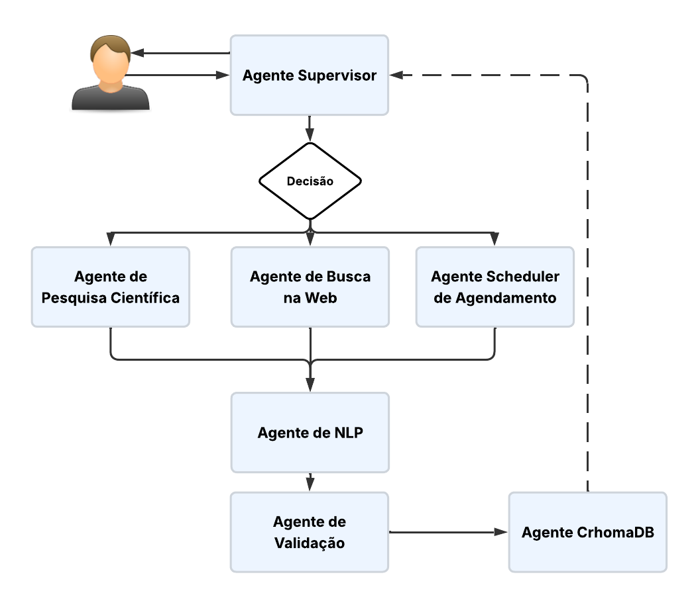

# 🌐 SAPIEN – Sistema de Agente para Pesquisa e Ensino

SAPIEN é um sistema **multiagente** para pesquisa científica automatizada.  
Ele coleta artigos do **arXiv** e da web, processa e valida os conteúdos com **LangGraph** e **Claude (Anthropic)**, e armazena tudo em um **banco vetorial ChromaDB**, permitindo consultas em linguagem natural.

> Este projeto foi desenvolvido como parte do **Minicurso CODEC 2025**.

---

## ✨ Principais Recursos

- **Busca científica em tempo real**: arXiv e web (via Tavily AI).  
- **Validação semântica** com embeddings HuggingFace.  
- **Armazenamento vetorial** em ChromaDB para consultas rápidas.  
- **Interface web interativa** em Flask + Bootstrap.  
- **Agendamentos automáticos** de pesquisas com APScheduler.  
- Arquitetura modular para fácil extensão e manutenção.

---

## 📂 Estrutura do Projeto

```

SapienAgent/
├─ app/                  # Aplicação Flask
│  ├─ core/              # Núcleo multiagente (agentes, serviços, config)
│  ├─ static/            # CSS, JS, imagens
│  └─ templates/         # Templates HTML
├─ chroma\_db/            # Banco vetorial local
├─ requirements.txt      # Dependências
└─ run.py                # Ponto de entrada

````

---

## 🚀 Instalação e Execução

### 1️⃣ Clonar o repositório
```bash
git clone https://github.com/larissaNa/SapienAgent.git
cd SapienAgent
````

### 2️⃣ Criar ambiente virtual

```bash
python -m venv venv
# Linux/macOS
source venv/bin/activate
# Windows
.\venv\Scripts\activate
```

### 3️⃣ Instalar dependências

```bash
pip install -r requirements.txt
```

### 4️⃣ Configurar variáveis de ambiente

Crie um arquivo `.env` na raiz do projeto:

```env
TAVILY_API_KEY="sua_chave_tavily"
ANTHROPIC_API_KEY="sua_chave_anthropic"
```

### 5️⃣ Executar o sistema

```bash
python run.py
```

A interface web estará disponível em: **[http://127.0.0.1:5000/](http://127.0.0.1:5000/)**

---

## 🧭 Fluxo do Sistema Multiagente

1. **Coleta** – `tavily_agent` e `arxiv_agent` buscam dados.
2. **Processamento NLP** – `nlp_agent` normaliza e extrai metadados.
3. **Validação** – `validation_agent` verifica relevância semântica.
4. **Armazenamento** – `chromadb_agent` indexa no ChromaDB.
5. **Consulta/Chat** – Respostas em linguagem natural para o usuário.



---

## 💡 Exemplos de Comandos no Chat

```bash
"pesquise sobre redes neurais durante 2 minutos a cada 30 segundos"
"cancelar busca sobre redes neurais"
"busque papers sobre transformers"
"Como está o clima hoje em Piripiri Piauí?"
```

---

## 🛠️ Tecnologias

| Biblioteca            | Uso Principal                         |
| --------------------- | ------------------------------------- |
| Flask                 | Interface web                         |
| LangGraph             | Orquestração multiagente              |
| LangChain             | Integração de LLMs                    |
| Claude (Anthropic)    | Modelo de linguagem                   |
| Tavily AI             | Busca web científica                  |
| ChromaDB              | Banco vetorial                        |
| sentence-transformers | Embeddings HuggingFace                |
| APScheduler           | Agendamentos periódicos               |
| arxiv                 | API para busca de artigos científicos |

---

## 👩‍🏫 Sobre o Minicurso

Este projeto integra o **Minicurso CODEC 2025**, demonstrando como criar um agente de pesquisa científica com:

* **LangGraph** para agentes baseados em estados
* **ChromaDB** para armazenamento vetorial
* **Claude** como modelo de linguagem
* **Tavily AI** para busca web científica

---

## 🤝 Contribuindo

Contribuições são bem-vindas!
Abra uma *issue* ou envie um *pull request* para melhorias e novas funcionalidades.

---

## 📄 Licença

Defina aqui a licença do projeto (ex.: MIT, Apache 2.0, etc.).

---

© 2025 SAPIEN – Sistema de Agente para Pesquisa e Ensino

```
